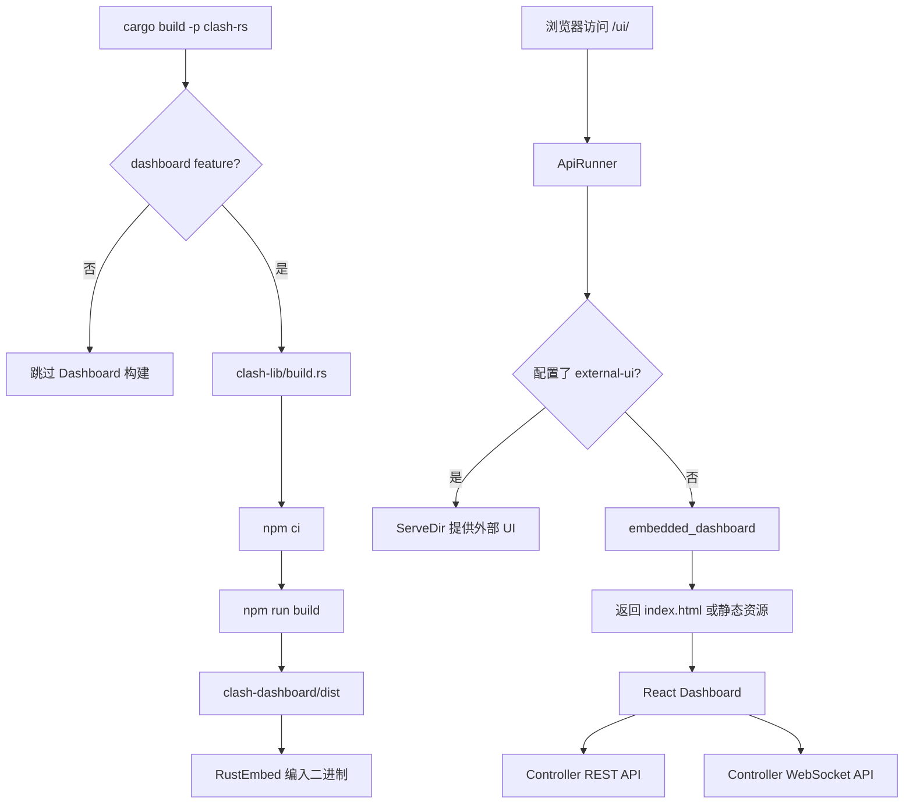

# 内置 Dashboard 功能说明

- 日期：2026-07-28
- 适用版本：0.23.0
- 功能开关：`dashboard`
- 默认入口：`http://<external-controller>/ui/`

## Summary

Chimera Client 现在提供一个随可执行文件分发的 Web Dashboard。它通过已有的
External Controller REST 与 WebSocket API 展示运行状态，并提供配置、代理组、连接、
流量、规则、DNS、日志和 Flow 等管理页面。

`clash-rs` 默认启用 `dashboard` feature。编译时，Vite 生产构建产物会通过
`rust-embed` 写入可执行文件；运行时不需要再部署单独的静态文件目录。原有
`external-ui` 配置仍具有更高优先级，因此已有外部 Dashboard 部署不会被覆盖。

## What Changed

### Web 控制面板

新增 `clash-dashboard/` React 单页应用，主要页面包括：

| 页面 | 能力 |
|---|---|
| Overview | 查看版本、内存、实时流量和入站配置，重载配置 |
| Proxies | 查看代理组与节点、切换节点、执行延迟测试 |
| Providers | 更新代理/规则 Provider、健康检查、查看 Provider 内容 |
| Connections | 实时查看连接并关闭单个或全部连接 |
| Flows | 按目标、来源、规则、链路和流量查看聚合 Flow |
| Rules | 浏览规则与 Rule Provider，执行匹配查询 |
| Logs | 通过 WebSocket 实时查看日志 |
| DNS | 通过 Controller API 执行 DNS 查询 |
| Settings | 设置 Controller 地址、认证密钥和界面主题 |

前端默认连接 `window.location.origin`。跨地址开发或管理其他实例时，可以在 Settings
中设置 API URL。REST 请求使用 `Authorization: Bearer <secret>`，WebSocket 使用
`?token=<secret>`，与 External Controller 的认证约定一致。

### 编译期集成

`clash-lib/build.rs` 在启用 `CARGO_FEATURE_DASHBOARD` 时执行：

1. 监听 Dashboard 源码与构建配置的变化。
2. 使用独立临时 npm cache 执行 `npm ci --prefer-offline`。
3. 执行 `npm run build`，生成 `clash-dashboard/dist/`。
4. 由 `RustEmbed` 在编译期读取 `dist/` 并嵌入 Rust 二进制。

未启用 `dashboard` feature 时，构建脚本直接返回，不要求执行前端构建。

### HTTP 路由与缓存

未配置 `external-ui` 时，External Controller 注册以下路由：

```text
GET /ui             -> 303 跳转到 /ui/
GET /ui/            -> 内嵌 index.html
GET /ui/{*path}     -> 内嵌静态资源或 SPA index.html 回退
```

`index.html` 使用 `Cache-Control: no-cache`，确保入口文件可以及时引用新构建资源。
JS、CSS、图片和字体使用一年 immutable 缓存；Vite 的内容哈希文件名保证版本更新后
浏览器请求新的资源。未知资源路径回退到 `index.html`，以支持单页应用客户端路由。

## Call Relationships



核心实现位置：

- `clash-dashboard/src/App.tsx`：页面路由。
- `clash-dashboard/src/lib/api.ts`：REST/WebSocket API 客户端。
- `clash-dashboard/src/lib/settings.ts`：Controller 地址和密钥存储。
- `clash-lib/build.rs`：前端编译流程。
- `clash-lib/src/app/api/embedded_dashboard.rs`：嵌入资源、MIME、缓存和 SPA 回退。
- `clash-lib/src/app/api/runner.rs`：`/ui/` 路由注册与 `external-ui` 优先级。

## Why

过去使用 Controller API 通常需要用户额外下载、配置和维护第三方 Dashboard。内置方案
使新安装在配置好 `external-controller` 后即可使用管理界面，并保证前端版本与当前
Controller API 实现一起构建和发布。

保留 `external-ui` 优先级，可以让已有部署继续选择 metacubexd、yacd 或其他外部界面，
同时给默认安装提供开箱即用的界面。

## Dependencies

### Rust

- `rust-embed 8.12.0`
  - 在 `clash-lib/src/app/api/embedded_dashboard.rs` 的 `Assets` 类型上使用。
  - 仅由 `dashboard` feature 启用。
- `anyhow 1.x`
  - 在 `clash-lib/build.rs` 中处理 npm 调用和构建失败。
  - 只作为 build dependency，不进入运行时业务路径。

### Frontend

`clash-dashboard/package-lock.json` 锁定主要依赖：

- React / React DOM `19.2.7`
- React Router DOM `7.18.1`
- TanStack React Query `5.101.2`
- uPlot `1.6.32`
- Tailwind CSS `4.3.2`
- lucide-react `1.22.0`
- Vite `8.1.2`
- TypeScript `6.0.3`

这些包均在 Dashboard 源码或构建配置中使用，不存在只添加但未引用的主要运行时依赖。

## Build and Usage

默认构建：

```bash
cargo build -p clash-rs
```

源码构建必须能找到 Node.js 和 npm。`npm ci` 使用 lockfile 安装确定版本；首次构建可能
需要访问 npm registry，后续构建可使用临时目录中的 npm cache。

运行时需要在配置中启用 External Controller，例如：

```yaml
external-controller: 127.0.0.1:13456
secret: chimera
```

启动客户端后访问：

```text
http://127.0.0.1:13456/ui/
```

如果需要不包含 Dashboard 的构建，可以关闭默认 feature 并显式选择所需能力，例如：

```bash
cargo build -p clash-rs --no-default-features \
  --features standard,aws-lc-rs
```

## Security

- Dashboard 不绕过 Controller API 鉴权；受保护请求仍必须提供配置中的 `secret`。
- 用户在 Settings 中填写的 API URL 和 secret 存储在浏览器 `localStorage`。
- 不应在不受信任的公共主机上打开 Dashboard，也不应向公网暴露未受网络访问控制保护的
  External Controller。
- `cors-allow-origins` 仍控制跨源访问。默认同源 `/ui/` 不需要额外 CORS 配置。

## Risk and Rollout

1. `dashboard` 成为 `clash-rs` 默认 feature 后，从源码执行默认构建需要 Node.js/npm。
2. 内嵌资源会增加可执行文件体积；当前生产 JS chunk 约 613 KB、gzip 后约 198 KB。
3. 前端初次构建需要安装 npm 依赖，在离线或 registry 不可用环境中可能失败。
4. immutable 缓存依赖 Vite 内容哈希；不要对非哈希文件复用同名不同内容。
5. secret 位于浏览器本地存储，浏览器环境中的恶意脚本或扩展可能读取它。

建议先在受控环境验证 `/ui/`、认证和 WebSocket，再进入正式发布流程。希望完全避免
Node.js 构建依赖的发行环境可以关闭 `dashboard` feature。

## Testing

已执行：

```text
cd clash-dashboard && npm run lint
cd clash-dashboard && npm run build
cargo check -p clash-lib --features dashboard
cargo check -p clash-rs
```

结果均通过。Vite 报告单个生产 chunk 超过 500 KB 的性能提醒，但不影响构建。

建议发布前补充：

- 启动真实 Controller 后访问 `/ui/` 的浏览器冒烟测试。
- 有 secret 和无 secret 两种认证场景。
- REST 页面与 `/ws/traffic`、`/ws/logs`、`/ws/connections`、`/ws/flows`。
- 配置 `external-ui` 时确认外部静态目录仍优先。
- Windows 环境下验证构建脚本调用 `npm.cmd`。

## Breaking Changes

没有 Controller API、配置字段或运行时路由的破坏性变更。`external-ui` 的行为保持不变。

构建环境有一项需要注意的变化：默认 feature 现在包含 `dashboard`，因此默认源码构建
新增 Node.js/npm 要求。发行包的最终用户不需要安装 Node.js。

## Migration

现有用户无需修改配置。只要已经启用 `external-controller`，升级后的默认构建即可通过
`/ui/` 使用内置界面。

如果已有 `external-ui`：

- 原配置继续生效；
- `/ui/` 继续由外部目录提供；
- 内置 Dashboard 不会覆盖外部资源。
