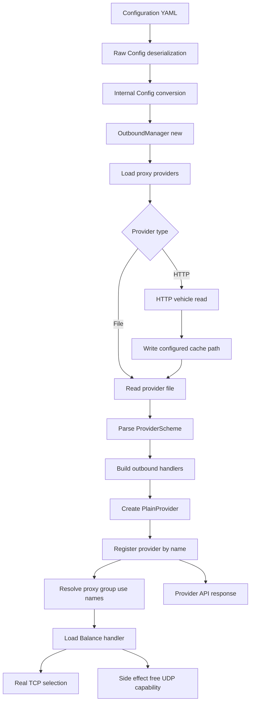

# Proxy Provider Code Change Documentation

- Date: 2026-07-31 21:27:44 +08:00
- Version: 0.24.2
- Scope: proxy provider configuration, file and HTTP startup loading, proxy-group `use:` integration, Load Balance routing behavior, integration coverage
- Commits: `046ef03`, `bd764a7`, `a7d7a27`

## Purpose and Behavior Changes

This change set connects Clash-style `proxy-providers` configuration to the runtime and proves that provider-backed proxy groups can carry real TCP traffic.

It adds three capabilities:

1. Top-level `proxy-providers` entries are deserialized and preserved during conversion into the internal configuration.
2. File providers are loaded from disk, while HTTP providers are downloaded once at startup, cached at their configured path, and then processed through the same parsing and health-check path.
3. Proxy groups using `use:` receive provider proxies before routing starts. Load Balance API reads no longer advance the Round-Robin selector.

## Problem Addressed

Before these changes, the runtime already contained partial provider and group infrastructure, but the public configuration path was disconnected:

- `proxy-providers` was absent from the raw configuration model.
- Internal conversion always produced an empty provider map.
- HTTP providers were explicitly skipped by `OutboundManager`.
- There was no end-to-end proof that a provider file could populate a `use:`-backed group and route traffic.
- Reading Load Balance metadata through the API called `support_udp()`, which selected a proxy and advanced Round-Robin state. An observability request could therefore change the next real connection's route.

Users with otherwise valid Clash configurations could not rely on provider-backed groups, and dashboard/API polling could perturb routing order.

## Why This Code Matters

The raw configuration layer owns YAML compatibility, while the internal conversion layer owns runtime-safe values. Preserving the provider map across both layers is necessary because `OutboundManager` must load providers before building groups that reference them.

`OutboundManager::new` intentionally calls `load_proxy_providers` before `load_handlers`. This ordering makes every configured provider available when `maybe_append_use_providers` resolves a group's `use:` names.

HTTP startup loading reuses the existing `http_vehicle::Vehicle` instead of introducing another HTTP stack. The downloaded bytes are cached and converted into an `OutboundFileProvider`, so provider parsing, protocol construction, health-check validation, and `PlainProvider` creation remain in one path.

The Load Balance `support_udp()` correction makes capability inspection side-effect free. It now returns the group's configured UDP policy, matching the reference implementation and keeping selection state exclusive to actual connection attempts.

## Before / After

- **Before:** A top-level `proxy-providers` section was discarded during conversion; file-backed groups could not be configured from ordinary YAML, HTTP providers were skipped, and an API read could advance Round-Robin state.
- **After:** File and HTTP provider definitions reach the runtime, provider proxies are attached through `use:`, HTTP content is cached locally, and API inspection does not alter routing order.
- **Example:** A `load-balance` group references provider `remote` through `use:`. At startup Chimera downloads `remote`, writes `providers/remote.yaml`, parses `DIRECT` and `REJECT`, exposes them through the Provider and Proxy APIs, and routes three TCP attempts as `DIRECT → REJECT → DIRECT`, even after the group is queried by the API.

## Affected Areas

| Area | Responsibility |
|---|---|
| [`clash-lib/src/config/def.rs#L122`](../clash-lib/src/config/def.rs#L122) | Deserializes the top-level `proxy-providers` map. |
| [`clash-lib/src/config/internal/proxy.rs#L441`](../clash-lib/src/config/internal/proxy.rs#L441) | Defines File/HTTP provider variants and injects the map key as the provider name. |
| [`clash-lib/src/config/internal/convert/mod.rs#L94`](../clash-lib/src/config/internal/convert/mod.rs#L94) | Preserves provider definitions in the internal configuration. |
| [`clash-lib/src/app/outbound/manager.rs#L803`](../clash-lib/src/app/outbound/manager.rs#L803) | Downloads, caches, parses, validates, and registers providers before group construction. |
| [`clash-lib/src/proxy/group/loadbalance/mod.rs#L120`](../clash-lib/src/proxy/group/loadbalance/mod.rs#L120) | Keeps UDP capability queries free of proxy-selection side effects. |
| [`clash-lib/tests/loadbalance_integration_tests.rs#L281`](../clash-lib/tests/loadbalance_integration_tests.rs#L281) | Verifies file-backed provider loading and real TCP routing. |
| [`clash-lib/tests/loadbalance_integration_tests.rs#L311`](../clash-lib/tests/loadbalance_integration_tests.rs#L311) | Verifies HTTP download, cache persistence, API exposure, and real TCP routing. |

## Call Relationships and Data Flow

**Node links fallback:**

| Node | Definition |
|---|---|
| B | [`clash-lib/src/config/def.rs#L122`](../clash-lib/src/config/def.rs#L122) |
| C | [`clash-lib/src/config/internal/convert/mod.rs#L94`](../clash-lib/src/config/internal/convert/mod.rs#L94) |
| D | [`clash-lib/src/app/outbound/manager.rs#L96`](../clash-lib/src/app/outbound/manager.rs#L96) |
| E | [`clash-lib/src/app/outbound/manager.rs#L803`](../clash-lib/src/app/outbound/manager.rs#L803) |
| H | [`clash-lib/src/app/remote_content_manager/providers/http_vehicle.rs#L50`](../clash-lib/src/app/remote_content_manager/providers/http_vehicle.rs#L50) |
| L | [`clash-lib/src/app/remote_content_manager/providers/proxy_provider/plain_provider.rs#L28`](../clash-lib/src/app/remote_content_manager/providers/proxy_provider/plain_provider.rs#L28) |
| N | [`clash-lib/src/app/outbound/manager.rs#L550`](../clash-lib/src/app/outbound/manager.rs#L550) |
| P | [`clash-lib/src/proxy/group/loadbalance/mod.rs#L124`](../clash-lib/src/proxy/group/loadbalance/mod.rs#L124) |
| Q | [`clash-lib/src/app/api/handlers/provider.rs#L63`](../clash-lib/src/app/api/handlers/provider.rs#L63) |
| R | [`clash-lib/src/proxy/group/loadbalance/mod.rs#L120`](../clash-lib/src/proxy/group/loadbalance/mod.rs#L120) |

## Validation

The completed batches passed:

- `cargo fmt --check`
- `cargo clippy -p clash-lib --lib --all-features -- -D warnings`
- `cargo test -p clash-lib --lib --all-features`: 431 passed, 11 ignored
- `cargo test -p clash-lib --test loadbalance_integration_tests --all-features`: 6 passed
- `cargo build -p clash-lib --all-features`

The integration tests cover:

- Provider configuration conversion and map-key name injection.
- File provider loading through a temporary working directory.
- HTTP provider download through a local mock server.
- Cache-file creation with downloaded provider bytes.
- Provider and group API visibility.
- Real SOCKS5 TCP routing through a provider-backed Round-Robin group.
- Stability of routing order after API metadata reads.

## New Dependencies

No dependencies were added. The HTTP path reuses the existing [`http_vehicle::Vehicle`](../clash-lib/src/app/remote_content_manager/providers/http_vehicle.rs#L21), existing DNS-aware HTTP client, Tokio filesystem APIs, Serde YAML parser, health-check implementation, and `PlainProvider` runtime type.

## Potential Gaps / Risks

1. **No dynamic refresh yet.** `interval` is parsed and preserved, but HTTP providers are downloaded only during startup. Provider API `PUT` still reaches `PlainProvider::update`, which is currently a no-op.
2. **No stale-cache fallback.** Startup currently fails when the HTTP request fails, even if a previously cached provider file exists.
3. **Cache writes are not atomic.** A crash during `tokio::fs::write` could leave a truncated cache file. A temporary-file plus rename strategy would reduce this risk.
4. **Startup is network-dependent.** HTTP provider download blocks outbound-manager initialization; timeout and retry policy are inherited from the existing HTTP client rather than configured per provider.
5. **HTTP status validation is indirect.** `http_vehicle::Vehicle` collects the response body; explicit rejection of non-success status codes should be confirmed or added.
6. **Provider vehicle identity is compatible rather than explicit.** After startup, both File and HTTP providers are represented by `PlainProvider`, so API `vehicleType` cannot fully describe their original source.
7. **Provider aliases for built-in Direct/Reject normalize to reserved handler names.** Tests assert the runtime/API behavior as `DIRECT` and `REJECT`; preserving arbitrary aliases would require separate protocol-handler changes.

## Recommended Follow-up

1. Introduce a mutable provider implementation backed by `Fetcher` and `http_vehicle::Vehicle`.
2. Make API `PUT /providers/proxies/:name` perform an immediate fetch and atomically replace the provider proxy set.
3. Start an interval-based refresh loop only after successful initial parsing.
4. Retain the previous healthy proxy set when a download or parse fails.
5. Add atomic cache replacement and stale-cache startup fallback.
6. Verify Selector, URL-Test, Fallback, Relay, and Load Balance groups all observe refreshed provider contents without process restart.

## References

- Reference raw configuration: [`ref/clash-lib/src/config/def.rs#L474`](../ref/clash-lib/src/config/def.rs#L474)
- Reference provider definitions: [`ref/clash-lib/src/config/internal/proxy.rs#L713`](../ref/clash-lib/src/config/internal/proxy.rs#L713)
- Reference provider loading lifecycle: [`ref/clash-lib/src/app/outbound/manager.rs#L870`](../ref/clash-lib/src/app/outbound/manager.rs#L870)
- Reference side-effect-free Load Balance UDP support: [`ref/clash-lib/src/proxy/group/loadbalance/mod.rs#L98`](../ref/clash-lib/src/proxy/group/loadbalance/mod.rs#L98)
- Implementation commits: `046ef03`, `bd764a7`, `a7d7a27`
